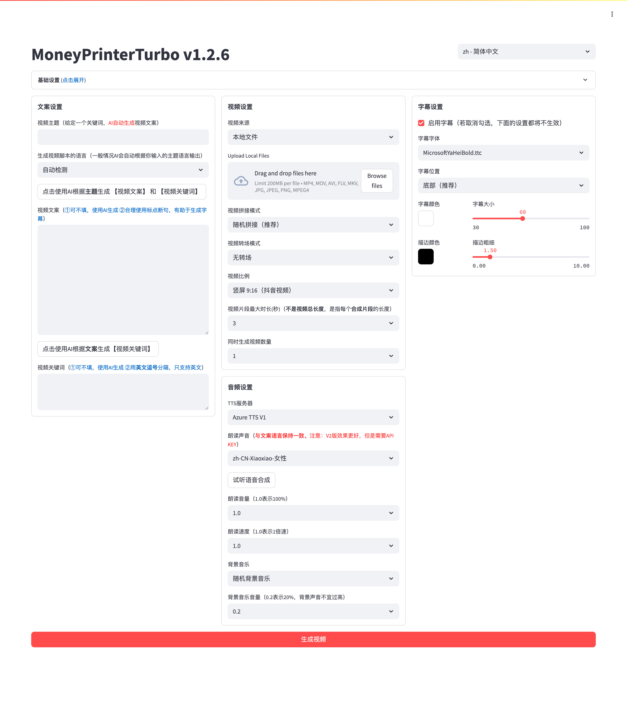

<div align="center">
<h1 align="center">MoneyPrinterTurbo 💸</h1>

<p align="center">
  <a href="https://github.com/harry0703/MoneyPrinterTurbo/stargazers"></a>
  <a href="https://github.com/harry0703/MoneyPrinterTurbo/issues"></a>
  <a href="https://github.com/harry0703/MoneyPrinterTurbo/network/members"></a>
  <a href="https://github.com/harry0703/MoneyPrinterTurbo/blob/main/LICENSE"></a>
</p>
<br>
<h3>简体中文 | <a href="README-en.md">English</a></h3>
<div align="center">
  <a href="https://trendshift.io/repositories/8731" target="_blank"></a>
</div>
<br>
只需提供一个视频 <b>主题</b> 或 <b>关键词</b> ，就可以全自动生成视频文案、视频素材、视频字幕、视频背景音乐，然后合成一个高清的短视频。
<br>

<h4>Web界面</h4>



<h4>API界面</h4>


</div>

## 特别感谢 🙏

由于该项目的 **部署** 和 **使用**，对于一些小白用户来说，还是 **有一定的门槛**，在此特别感谢
**录咖（AI智能 多媒体服务平台）** 网站基于该项目，提供的免费`AI视频生成器`服务，可以不用部署，直接在线使用，非常方便。

- 中文版：https://reccloud.cn
- 英文版：https://reccloud.com


## 感谢赞助 🙏

感谢佐糖 https://picwish.cn 对该项目的支持和赞助，使得该项目能够持续的更新和维护。

佐糖专注于**图像处理领域**，提供丰富的**图像处理工具**，将复杂操作极致简化，真正实现让图像处理更简单。


## 功能特性 🎯

- [x] 完整的 **MVC架构**，代码 **结构清晰**，易于维护，支持 `API` 和 `Web界面`
- [x] 支持视频文案 **AI自动生成**，也可以**自定义文案**
- [x] 支持多种 **高清视频** 尺寸
    - [x] 竖屏 9:16，`1080x1920`
    - [x] 横屏 16:9，`1920x1080`
- [x] 支持 **批量视频生成**，可以一次生成多个视频，然后选择一个最满意的
- [x] 支持 **视频片段时长** 设置，方便调节素材切换频率
- [x] 支持 **中文** 和 **英文** 视频文案
- [x] 支持 **多种语音** 合成，可 **实时试听** 效果
- [x] 支持 **字幕生成**，可以调整 `字体`、`位置`、`颜色`、`大小`，同时支持`字幕描边`设置
- [x] 支持 **背景音乐**，随机或者指定音乐文件，可设置`背景音乐音量`
- [x] 视频素材来源 **高清**，而且 **无版权**，也可以使用自己的 **本地素材**
- [x] 支持 **OpenAI**、**Moonshot**、**Azure**、**gpt4free**、**one-api**、**通义千问**、**Google Gemini**、**Ollama**、**DeepSeek**、 **文心一言**, **Pollinations** 等多种模型接入
    - 中国用户建议使用 **DeepSeek** 或 **Moonshot** 作为大模型提供商（国内可直接访问，不需要VPN。注册就送额度，基本够用）


### 后期计划 📅

- [ ] GPT-SoVITS 配音支持
- [ ] 优化语音合成，利用大模型，使其合成的声音，更加自然，情绪更加丰富
- [ ] 增加视频转场效果，使其看起来更加的流畅
- [ ] 增加更多视频素材来源，优化视频素材和文案的匹配度
- [ ] 增加视频长度选项：短、中、长
- [ ] 支持更多的语音合成服务商，比如 OpenAI TTS
- [ ] 自动上传到YouTube平台

## 视频演示 📺

### 竖屏 9:16

<table>
<thead>
<tr>
<th align="center"><g-emoji class="g-emoji" alias="arrow_forward">▶️</g-emoji> 《如何增加生活的乐趣》</th>
<th align="center"><g-emoji class="g-emoji" alias="arrow_forward">▶️</g-emoji> 《金钱的作用》<br>更真实的合成声音</th>
<th align="center"><g-emoji class="g-emoji" alias="arrow_forward">▶️</g-emoji> 《生命的意义是什么》</th>
</tr>
</thead>
<tbody>
<tr>
<td align="center"><video src="https://github.com/harry0703/MoneyPrinterTurbo/assets/4928832/a84d33d5-27a2-4aba-8fd0-9fb2bd91c6a6"></video></td>
<td align="center"><video src="https://github.com/harry0703/MoneyPrinterTurbo/assets/4928832/af2f3b0b-002e-49fe-b161-18ba91c055e8"></video></td>
<td align="center"><video src="https://github.com/harry0703/MoneyPrinterTurbo/assets/4928832/112c9564-d52b-4472-99ad-970b75f66476"></video></td>
</tr>
</tbody>
</table>

### 横屏 16:9

<table>
<thead>
<tr>
<th align="center"><g-emoji class="g-emoji" alias="arrow_forward">▶️</g-emoji>《生命的意义是什么》</th>
<th align="center"><g-emoji class="g-emoji" alias="arrow_forward">▶️</g-emoji>《为什么要运动》</th>
</tr>
</thead>
<tbody>
<tr>
<td align="center"><video src="https://github.com/harry0703/MoneyPrinterTurbo/assets/4928832/346ebb15-c55f-47a9-a653-114f08bb8073"></video></td>
<td align="center"><video src="https://github.com/harry0703/MoneyPrinterTurbo/assets/4928832/271f2fae-8283-44a0-8aa0-0ed8f9a6fa87"></video></td>
</tr>
</tbody>
</table>

## 配置要求 📦

- 建议最低 CPU **4核** 或以上，内存 **4G** 或以上，显卡非必须
- Windows 10 或 MacOS 11.0 以上系统


## 快速开始 🚀

### 在 Google Colab 中运行
免去本地环境配置，点击直接在 Google Colab 中快速体验 MoneyPrinterTurbo

[](https://colab.research.google.com/github/harry0703/MoneyPrinterTurbo/blob/main/docs/MoneyPrinterTurbo.ipynb)


### Windows一键启动包

下载一键启动包，解压直接使用（路径不要有 **中文**、**特殊字符**、**空格**）

- 百度网盘（v1.2.6）: https://pan.baidu.com/s/1wg0UaIyXpO3SqIpaq790SQ?pwd=sbqx 提取码: sbqx
- Google Drive (v1.2.6): https://drive.google.com/file/d/1HsbzfT7XunkrCrHw5ncUjFX8XX4zAuUh/view?usp=sharing

下载后，建议先**双击执行** `update.bat` 更新到**最新代码**，然后双击 `start.bat` 启动

启动后，会自动打开浏览器（如果打开是空白，建议换成 **Chrome** 或者 **Edge** 打开）

## 安装部署 📥

### 前提条件

- 尽量不要使用 **中文路径**，避免出现一些无法预料的问题
- 请确保你的 **网络** 是正常的，VPN需要打开`全局流量`模式

#### ① 克隆代码

```shell
git clone https://github.com/harry0703/MoneyPrinterTurbo.git
```

#### ② 修改配置文件（可选，建议启动后也可以在 WebUI 里面配置）

- 将 `config.example.toml` 文件复制一份，命名为 `config.toml`
- 按照 `config.toml` 文件中的说明，配置好 `pexels_api_keys` 和 `llm_provider`，并根据 llm_provider 对应的服务商，配置相关的
  API Key

### Docker部署 🐳

#### ① 启动Docker

如果未安装 Docker，请先安装 https://www.docker.com/products/docker-desktop/

如果是Windows系统，请参考微软的文档：

1. https://learn.microsoft.com/zh-cn/windows/wsl/install
2. https://learn.microsoft.com/zh-cn/windows/wsl/tutorials/wsl-containers

```shell
cd MoneyPrinterTurbo
docker-compose up
```

> 注意：最新版的docker安装时会自动以插件的形式安装docker compose，启动命令调整为docker compose up

#### ② 访问Web界面

打开浏览器，访问 http://0.0.0.0:8501

#### ③ 访问API文档

打开浏览器，访问 http://0.0.0.0:8080/docs 或者 http://0.0.0.0:8080/redoc

### 手动部署 📦

> 视频教程

- 完整的使用演示：https://v.douyin.com/iFhnwsKY/
- 如何在Windows上部署：https://v.douyin.com/iFyjoW3M

#### ① 创建虚拟环境

建议使用 [conda](https://conda.io/projects/conda/en/latest/user-guide/install/index.html) 创建 python 虚拟环境

```shell
git clone https://github.com/harry0703/MoneyPrinterTurbo.git
cd MoneyPrinterTurbo
conda create -n MoneyPrinterTurbo python=3.11
conda activate MoneyPrinterTurbo
pip install -r requirements.txt
```

#### ② 安装好 ImageMagick

- Windows:
    - 下载 https://imagemagick.org/script/download.php 选择Windows版本，切记一定要选择 **静态库** 版本，比如
      ImageMagick-7.1.1-32-Q16-x64-**static**.exe
    - 安装下载好的 ImageMagick，**注意不要修改安装路径**
    - 修改 `配置文件 config.toml` 中的 `imagemagick_path` 为你的 **实际安装路径**

- MacOS:
  ```shell
  brew install imagemagick
  ````
- Ubuntu
  ```shell
  sudo apt-get install imagemagick
  ```
- CentOS
  ```shell
  sudo yum install ImageMagick
  ```

#### ③ 启动Web界面 🌐

注意需要到 MoneyPrinterTurbo 项目 `根目录` 下执行以下命令

###### Windows

```bat
webui.bat
```

###### MacOS or Linux

```shell
sh webui.sh
```

启动后，会自动打开浏览器（如果打开是空白，建议换成 **Chrome** 或者 **Edge** 打开）

#### ④ 启动API服务 🚀

```shell
python main.py
```

启动后，可以查看 `API文档` http://127.0.0.1:8080/docs 或者 http://127.0.0.1:8080/redoc 直接在线调试接口，快速体验。

## 语音合成 🗣

所有支持的声音列表，可以查看：[声音列表](./docs/voice-list.txt)

2024-04-16 v1.1.2 新增了9种Azure的语音合成声音，需要配置API KEY，该声音合成的更加真实。

## 字幕生成 📜

当前支持2种字幕生成方式：

- **edge**: 生成`速度快`，性能更好，对电脑配置没有要求，但是质量可能不稳定
- **whisper**: 生成`速度慢`，性能较差，对电脑配置有一定要求，但是`质量更可靠`。

可以修改 `config.toml` 配置文件中的 `subtitle_provider` 进行切换

建议使用 `edge` 模式，如果生成的字幕质量不好，再切换到 `whisper` 模式

> 注意：

1. whisper 模式下需要到 HuggingFace 下载一个模型文件，大约 3GB 左右，请确保网络通畅
2. 如果留空，表示不生成字幕。

> 由于国内无法访问 HuggingFace，可以使用以下方法下载 `whisper-large-v3` 的模型文件

下载地址：

- 百度网盘: https://pan.baidu.com/s/11h3Q6tsDtjQKTjUu3sc5cA?pwd=xjs9
- 夸克网盘：https://pan.quark.cn/s/3ee3d991d64b

模型下载后解压，整个目录放到 `.\MoneyPrinterTurbo\models` 里面，
最终的文件路径应该是这样: `.\MoneyPrinterTurbo\models\whisper-large-v3`

```
MoneyPrinterTurbo  
  ├─models
  │   └─whisper-large-v3
  │          config.json
  │          model.bin
  │          preprocessor_config.json
  │          tokenizer.json
  │          vocabulary.json
```

## 背景音乐 🎵

用于视频的背景音乐，位于项目的 `resource/songs` 目录下。
> 当前项目里面放了一些默认的音乐，来自于 YouTube 视频，如有侵权，请删除。

## 字幕字体 🅰

用于视频字幕的渲染，位于项目的 `resource/fonts` 目录下，你也可以放进去自己的字体。

## 常见问题 🤔

### ❓RuntimeError: No ffmpeg exe could be found

通常情况下，ffmpeg 会被自动下载，并且会被自动检测到。
但是如果你的环境有问题，无法自动下载，可能会遇到如下错误：

```
RuntimeError: No ffmpeg exe could be found.
Install ffmpeg on your system, or set the IMAGEIO_FFMPEG_EXE environment variable.
```

此时你可以从 https://www.gyan.dev/ffmpeg/builds/ 下载ffmpeg，解压后，设置 `ffmpeg_path` 为你的实际安装路径即可。

```toml
[app]
# 请根据你的实际路径设置，注意 Windows 路径分隔符为 \\
ffmpeg_path = "C:\\Users\\harry\\Downloads\\ffmpeg.exe"
```

### ❓ImageMagick的安全策略阻止了与临时文件@/tmp/tmpur5hyyto.txt相关的操作

可以在ImageMagick的配置文件policy.xml中找到这些策略。
这个文件通常位于 /etc/ImageMagick-`X`/ 或 ImageMagick 安装目录的类似位置。
修改包含`pattern="@"`的条目，将`rights="none"`更改为`rights="read|write"`以允许对文件的读写操作。

### ❓OSError: [Errno 24] Too many open files

这个问题是由于系统打开文件数限制导致的，可以通过修改系统的文件打开数限制来解决。

查看当前限制

```shell
ulimit -n
```

如果过低，可以调高一些，比如

```shell
ulimit -n 10240
```

### ❓Whisper 模型下载失败，出现如下错误

LocalEntryNotfoundEror: Cannot find an appropriate cached snapshotfolderfor the specified revision on the local disk and
outgoing trafic has been disabled.
To enablerepo look-ups and downloads online, pass 'local files only=False' as input.

或者

An error occured while synchronizing the model Systran/faster-whisper-large-v3 from the Hugging Face Hub:
An error happened while trying to locate the files on the Hub and we cannot find the appropriate snapshot folder for the
specified revision on the local disk. Please check your internet connection and try again.
Trying to load the model directly from the local cache, if it exists.

解决方法：[点击查看如何从网盘手动下载模型](#%E5%AD%97%E5%B9%95%E7%94%9F%E6%88%90-)

## 反馈建议 📢

- 可以提交 [issue](https://github.com/harry0703/MoneyPrinterTurbo/issues)
  或者 [pull request](https://github.com/harry0703/MoneyPrinterTurbo/pulls)。

## 许可证 📝

点击查看 [`LICENSE`](LICENSE) 文件

## Star History

[](https://star-history.com/#harry0703/MoneyPrinterTurbo&Date)


## 📚 项目文档说明

### 核心文档
- **README.md**: 项目主文档（本文件）
- **启动说明.md**: 详细的启动步骤和常见问题解决方案
- **本地素材使用说明.md**: 本地视频素材的管理和使用指南
- **项目迁移指南.md**: 环境迁移和配置复制指南

### AI助手记忆系统 🧠
为了解决在Cursor中切换项目导致AI助手记忆丢失的问题，本项目提供了完整的记忆存储系统：

- **AI助手记忆存储.md**: 完整的项目状态、配置信息、问题解决历史
- **未来开发计划.md**: 详细的功能扩展规划和实施路径  
- **记忆恢复指南.md**: 在新的AI会话中快速恢复上下文的操作指南

#### 如何使用记忆恢复功能
当你在Cursor中切换到其他项目后，再回到VideoGenius时：

1. 在新的AI聊天窗口中复制粘贴以下内容：
```
请阅读 AI助手记忆存储.md 文件，恢复对VideoGenius项目的上下文。

我是那个不懂代码的初中生用户，请继续用简单易懂的方式帮助我。

请按照你之前的角色定位和工作原则来协助我：
- 你是20年经验的产品经理和全栈工程师
- 专为初学者服务，用最简单的方法解决问题
- 主动完成所有工作，不需要我多次推动
- 总是先理解项目，再提供解决方案
```

2. AI助手会自动读取记忆文件，恢复对项目的完整了解
3. 继续像之前一样为您提供个性化的技术支持

这个系统确保了无论何时何地，AI助手都能为您提供连贯、专业的服务。

## 🎯 项目当前状态 - VideoGenius

### 环境配置 ✅
- Python 3.12.6 环境已配置
- 所有依赖包已正确安装
- Streamlit Web界面正常运行 (http://localhost:8501)

### AI模型配置 ✅  
- 硅基流动 DeepSeek-V3 模型已集成
- API配置完成，连接正常
- 支持中英文视频文案生成

### 视频素材管理 ✅
- 本地素材模式已启用
- 8个高质量MP4素材可用
- 自动格式检查和错误处理

### 智能启动系统 ✅ **新增 (2025年5月)**
- 🚀 launcher.bat - 主启动器菜单
- 🔧 start_smart.bat - 智能启动脚本
- 🔍 check_env.bat - 环境检查工具
- 📋 完整的用户友好错误提示

### 核心功能状态
- ✅ AI文案生成: 正常工作  
- ✅ 语音合成: Azure TTS中文语音
- ✅ 字幕生成: edge模式正常
- ✅ 视频合成: MoviePy引擎稳定运行
- ✅ 背景音乐: 支持随机和指定音乐
- ✅ 智能启动: 一键启动，自动修复问题

**VideoGenius项目完全可用，现在启动更加简单便捷！**

# 🎬 VideoGenius

> **AI驱动的智能视频生成工具** - 让创意变成现实

## 📖 项目简介

VideoGenius 是一个基于人工智能的智能视频生成工具，只需输入主题或关键词，即可自动生成高质量的短视频。项目使用Python开发，集成了多种AI服务，支持自动化的视频文案生成、素材搜索、语音合成、字幕添加和视频编辑。

### ✨ 核心特性

🤖 **AI智能生成**
- 基于大语言模型的智能文案创作
- 自动关键词提取和素材匹配
- 多语言支持和本地化

🎨 **现代化界面** *(2025年5月新增)*
- 精美的深色主题设计
- 响应式布局，完美适配移动端
- 直观的操作流程和实时状态反馈
- 现代化的进度条和状态指示器

🎬 **专业视频制作**
- 支持多种视频比例（16:9横屏 / 9:16竖屏）
- 丰富的转场效果和拼接模式
- 高质量视频输出和压缩优化

🎵 **多样化音频**
- 集成Azure TTS和SiliconFlow语音合成
- 支持多种语音风格和语言
- 自定义背景音乐和音量控制

💬 **智能字幕系统**
- 自动语音识别和字幕生成
- 多种字幕样式和位置选择
- 实时字幕预览功能

📂 **丰富素材来源**
- Pexels高质量免费视频素材
- Pixabay图片和视频资源
- 本地文件上传支持
- 主流视频平台素材爬取

## 🚀 快速开始

### 环境要求
- Python 3.8+ (推荐Python 3.12)
- Windows 10/11 或 macOS 或 Linux
- 4GB+ 可用内存
- 稳定的网络连接

### 一键启动

1. **使用智能启动器**（推荐）
   ```bash
   # 双击运行
   launcher.bat
   
   # 或者命令行运行
   .\launcher.bat
   ```

2. **选择启动选项**
   - `1` - 智能启动（推荐，包含环境检查）
   - `2` - 快速启动
   - `3` - 环境检查
   - `4` - 配置助手
   - `5` - 查看文档

3. **访问界面**
   - 自动打开浏览器：http://localhost:8501
   - 享受全新的现代化界面体验！

### 手动启动
```bash
# 设置环境路径
set PYTHONPATH=%CD%

# 启动应用
py -m streamlit run webui\Main.py --server.port=8501
```

## 🎨 界面展示

### 新版现代化界面特性
- **🌟 炫酷主题**：深色渐变背景，现代化卡片设计
- **📱 移动适配**：完美支持手机、平板访问
- **🎯 状态指示**：实时显示配置状态和操作反馈  
- **⚡ 流畅动画**：淡入动画、悬停效果、加载动画
- **🔧 智能提示**：详细的帮助说明和配置建议

### 主要界面区域
1. **英雄区域**：VideoGenius品牌展示和功能特性
2. **配置面板**：AI模型、素材源、性能参数设置
3. **脚本生成**：主题输入、AI生成、实时预览
4. **视频设置**：画面比例、转场效果、时长控制
5. **音频配置**：语音合成、背景音乐、音量调节
6. **字幕设置**：字体样式、位置、颜色预览
7. **生成控制**：智能检查、进度显示、结果展示

## ⚙️ 配置指南

### 1. AI模型配置

**推荐配置（国内用户）**
- **DeepSeek**：免费额度充足，无需VPN
  - API Key: [申请地址](https://platform.deepseek.com/api_keys)
  - Base URL: `https://api.deepseek.com`
  - Model: `deepseek-chat`

- **Moonshot**：质量稳定，响应快速
  - API Key: [申请地址](https://platform.moonshot.cn/console/api-keys)
  - Base URL: `https://api.moonshot.cn/v1`
  - Model: `moonshot-v1-8k`

### 2. 视频素材配置

**Pexels（推荐）**
- 免费高质量视频素材
- API Key: [申请地址](https://www.pexels.com/api/)
- 素材丰富，质量优秀

**Pixabay**
- 图片和视频兼备
- API Key: [申请地址](https://pixabay.com/api/docs/)
- 素材种类多样

### 3. 语音合成配置

**SiliconFlow TTS（推荐）**
- 国内服务，速度快
- API Key: [申请地址](https://cloud.siliconflow.cn/)
- 支持多种语音风格

**Azure TTS**
- 微软官方服务
- 需要Azure订阅
- 语音质量极高

## 📁 项目结构

```
VideoGenius/
├── 📁 webui/                  # Web界面
│   ├── Main.py               # 主界面文件
│   ├── styles.py             # 现代化样式
│   └── .streamlit/           # Streamlit配置
├── 📁 app/                    # 核心应用
│   ├── config/               # 配置管理
│   ├── models/               # 数据模型
│   ├── services/             # 业务服务
│   └── utils/                # 工具函数
├── 📁 storage/                # 存储目录
│   ├── tasks/                # 生成任务
│   └── video_materials/      # 视频素材
├── 📁 resource/               # 资源文件
│   ├── fonts/                # 字体文件
│   └── songs/                # 背景音乐
├── 🎯 launcher.bat            # 智能启动器
├── 🔧 start_smart.bat         # 智能启动脚本
├── 🛠️ check_env.bat          # 环境检查工具
└── 📋 README.md              # 项目说明
```

## 🛠️ 开发进展

### ✅ 已完成功能

#### 第一阶段：基础功能完善
- ✅ **简化启动流程**（2025年5月完成）
  - 智能启动脚本和环境检查
  - 自动依赖安装和配置修复
  - 用户友好的启动器菜单

- ✅ **界面优化**（2025年5月完成）
  - 现代化深色主题设计
  - 响应式移动端适配
  - 进度条和状态指示器
  - 动画效果和用户反馈

#### 核心功能
- ✅ AI文案生成（支持多种模型）
- ✅ 多素材源集成（Pexels、Pixabay、本地）
- ✅ 语音合成（Azure TTS、SiliconFlow）
- ✅ 智能字幕系统
- ✅ 视频编辑和合成
- ✅ 配置管理和持久化

### 🚧 开发中功能

#### 第二阶段：功能扩展（预计3-4周）
- 🔄 **配置管理优化**
  - 图形化配置界面
  - 配置验证和错误检查
  - 配置备份和恢复

- 🔄 **素材管理增强**
  - 自动检查和修复素材文件
  - 支持更多视频格式
  - 素材预览和管理界面

#### 第三阶段：高级功能（预计5-8周）
- 📋 **批量处理功能**
- 📋 **模板系统**
- 📋 **社交媒体集成**
- 📋 **AI能力增强**

## 🎯 使用技巧

### 最佳实践
1. **主题选择**：选择具体、有针对性的主题
2. **关键词优化**：使用准确的关键词获得更好的素材
3. **参数调整**：根据目标平台调整视频比例和时长
4. **音频平衡**：合理调整语音和背景音乐的音量比例

### 常见问题
- **生成失败**：检查API配置和网络连接
- **素材不匹配**：优化关键词或更换素材源
- **音频问题**：确认TTS服务配置正确
- **字幕错位**：调整字幕位置和字体大小

## 🤝 贡献指南

我们欢迎所有形式的贡献！

### 贡献方式
- 🐛 报告Bug和问题
- 💡 提出新功能建议  
- 📖 改进文档
- 🔧 提交代码修复
- 🎨 界面设计优化

### 开发环境
```bash
# 克隆仓库
git clone https://github.com/your-repo/VideoGenius.git

# 安装依赖
pip install -r requirements.txt

# 启动开发服务器
streamlit run webui/Main.py
```

## 📄 许可证

本项目基于 [MIT许可证](LICENSE) 开源。

## 🙏 致谢

- **Streamlit** - 优秀的Python Web框架
- **OpenAI/DeepSeek/Moonshot** - 强大的AI语言模型
- **Pexels/Pixabay** - 丰富的免费素材资源
- **Azure/SiliconFlow** - 高质量语音合成服务

## 📞 联系我们

- 🐛 Bug报告：[GitHub Issues](https://github.com/your-repo/VideoGenius/issues)
- 💬 功能建议：[GitHub Discussions](https://github.com/your-repo/VideoGenius/discussions)
- 📧 邮箱联系：your-email@example.com

---

<div align="center">

**🎬 VideoGenius - 让AI助力您的视频创作之旅！**

*如果这个项目对您有帮助，请给我们一个 ⭐ Star！*

</div>

# VideoGenius - AI视频生成工具

VideoGenius是一个基于AI的智能视频生成工具，能够根据主题或关键词自动生成视频脚本、素材、字幕和背景音乐，并合成高清短视频。

## 🚀 快速开始

### 环境要求
- Python 3.8+
- Windows/macOS/Linux

### 安装步骤

1. **克隆项目**
```bash
git clone https://github.com/harry0703/MoneyPrinterTurbo.git
cd VideoGenius
```

2. **安装依赖**
```bash
pip install -r requirements.txt
```

3. **启动应用**
```bash
# Windows
set PYTHONPATH=%CD% && python -m streamlit run webui\Main.py --server.port=8501 --server.address=localhost --browser.gatherUsageStats=false

# macOS/Linux  
export PYTHONPATH=$PWD && python -m streamlit run webui/Main.py --server.port=8501 --server.address=localhost --browser.gatherUsageStats=false
```

4. **访问应用**
打开浏览器访问：http://localhost:8501

## ✨ 主要功能

### 🎬 视频生成
- **AI智能脚本生成**：输入主题，AI自动生成视频脚本
- **多素材源支持**：Pexels、Pixabay、本地文件等
- **智能语音合成**：支持Azure TTS、SiliconFlow等多种TTS服务
- **自定义字幕**：可配置字体、颜色、位置等
- **背景音乐**：支持随机或自定义背景音乐

### 🎛️ 配置管理
- **AI模型配置**：支持OpenAI、DeepSeek、Moonshot等多种LLM
- **语音合成配置**：Azure TTS、SiliconFlow TTS等
- **素材源配置**：Pexels、Pixabay API配置
- **界面个性化**：多语言支持、主题设置等

### 🌐 多语言支持
- **中文**（简体中文）
- **英文**（English）
- 其他语言正在完善中

## 🔧 配置说明

### AI模型配置
推荐使用以下AI服务商：

1. **DeepSeek**（推荐）
   - 国内用户友好，无需VPN
   - 免费额度充足
   - API申请：https://platform.deepseek.com/api_keys

2. **Moonshot**
   - 国内服务，响应快速
   - API申请：https://platform.moonshot.cn/console/api-keys

3. **OpenAI**
   - 需要VPN访问
   - API申请：https://platform.openai.com/api-keys

### 素材源配置
1. **Pexels**（推荐）
   - 免费高质量视频素材
   - API申请：https://www.pexels.com/api/

2. **Pixabay**
   - 丰富的图片和视频素材
   - API申请：https://pixabay.com/api/docs/

### 语音合成配置
1. **Azure TTS**
   - 高质量语音合成
   - 配置：https://portal.azure.com/#view/Microsoft_Azure_ProjectOxford/CognitiveServicesHub/~/SpeechServices

2. **SiliconFlow TTS**
   - 国内服务，配置简单
   - API申请：https://cloud.siliconflow.cn/account/ak

## 🛠️ 故障排除

### 常见问题

1. **应用启动失败**
   - 检查Python版本是否为3.8+
   - 确保所有依赖已正确安装
   - 检查端口8501是否被占用

2. **多语言菜单错误**
   - 已修复：Streamlit菜单项URL格式问题
   - 确保翻译文件格式正确

3. **API配置问题**
   - 检查API Key是否正确
   - 确认网络连接正常
   - 验证API服务商的配额和权限

4. **视频生成失败**
   - 检查AI模型API配置
   - 确认素材源API可用
   - 检查磁盘空间是否充足

### 最近修复的问题

#### 多语言菜单项错误修复（2025-05-27）
**问题**：Streamlit菜单项包含描述性文本而非纯URL，导致`StreamlitInvalidURLError`

**解决方案**：
- 修复了所有翻译文件中的菜单项格式
- 将多语言初始化移到`st.set_page_config()`之前
- 确保菜单项使用纯URL格式

**影响的文件**：
- `webui/i18n/zh.json`
- `webui/i18n/en.json` 
- `webui/i18n/de.json`
- `webui/i18n/vi.json`
- `webui/i18n/pt.json`
- `webui/Main.py`

## 📝 更新日志

### v1.2.6 (2025-05-27)
- ✅ 修复多语言菜单项URL格式错误
- ✅ 优化多语言初始化流程
- ✅ 改进界面导航体验
- ✅ 限制语言选择为完全支持的语言（中文、英文）

### 开发计划
- 🔄 完善其他语言翻译
- 🔄 添加更多TTS服务商支持
- 🔄 优化视频生成性能
- 🔄 增加更多视频效果和转场

## 🤝 贡献指南

欢迎提交Issue和Pull Request来帮助改进项目！

1. Fork项目
2. 创建功能分支
3. 提交更改
4. 推送到分支
5. 创建Pull Request

## 📄 许可证

本项目采用MIT许可证 - 查看[LICENSE](LICENSE)文件了解详情

## 🔗 相关链接

- [GitHub项目地址](https://github.com/harry0703/MoneyPrinterTurbo)
- [问题反馈](https://github.com/harry0703/MoneyPrinterTurbo/issues)
- [获取帮助](https://harryai.cc)

---

**VideoGenius** - 让AI为您创造精彩视频内容！🎬✨